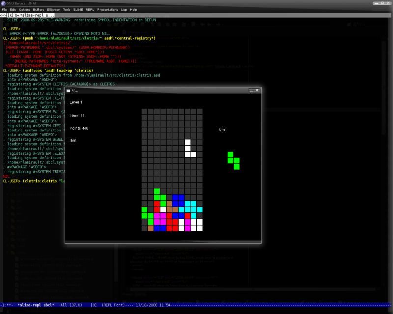

Cletris
=======

This is the classic [Tetris](http://en.wikipedia.org/wiki/Tetris) game in Common Lisp.

## Required softwares

You will need :

* [SBCL](http://www.sbcl.org)
* [Quicklisp](http://www.quicklisp.org)

and dependencies :

    $ sudo apt-get install libsdl1.2-dev libsdl-image1.2-dev libsdl-mixer1.2-dev

## Installation

    CL-USER> (ql:quickload "cletris")

## Launch game

In a lisp REPL :

    CL-USER> (cletris:cletris "myusername")

or from shell:

    $ ./cletris.sh

## Commands

Available commands :

* s : Start a new game
* Left : Move the current block to the left
* Right : Move the current block to the right
* Up : Rotate the current block
* Down : Move the current block down
* Space : Move the current block all the way down.
* p : Pause game
* v : View score (when user not playing a game).
* q : Quit Cletris

## Screenshots

## Changelog

A changelog is available [here](ChangeLog.md).

## Contact

Nicolas Lamirault <nicolas.lamirault@gmail.com>
